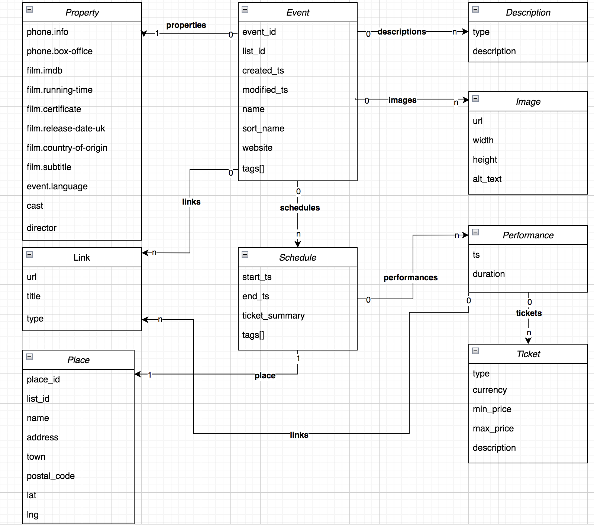
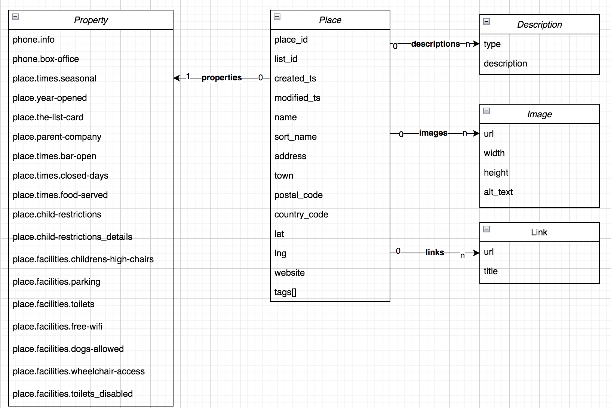

# Exploring_TheList_Data

This repo has a collection of scripts, and notebooks for mining [The LIST](https://api.list.co.uk/). The API serves two main types of **data events and places**. 
Here we can find facilities for: 
- Downloading LIST events & places to json files
- Upload events & places json files to an ElasticSearch
- Explore and Analyse Events - Mining Events data - Using Pandas DataFrames & Deep Learning Transformers.  

For visualizing the "Anlyasing_Events" we recommend to use the [nbviewer](https://nbviewer.org/github/rosafilgueira/Exploring_TheList_Data/blob/main/Analysing_Events.ipynb), since it has several images created with plotly. 

For downlading data from the [LIST API](https://api.list.co.uk/getting-started), it is necessary to register and get an API KEY.

Events and places data are downloaded as a collection of documents. Having a document (which is a dictionary) per event and per place.
Bellow we have as an example, a place document and event document. 

The events and places fully documented in this [link](https://api.list.co.uk/documentation). 

A representation of events information can be visualized bellow

