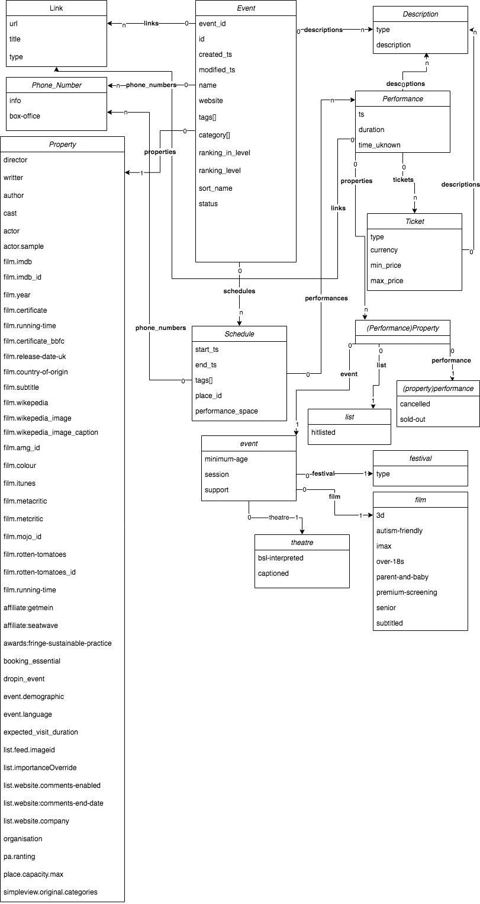
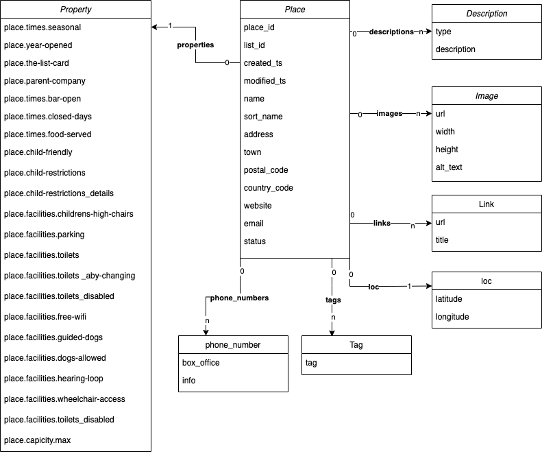

## 1 Notebooks
We have created two notebooks that allows you to run different analyses and visualizations (e.g. frequency, topic modelling, histograms, maps, etc.) at different levels (events, schedules, performances, tickets, etc. ) and periods of time:

  - [Genearate_List_Dataframes](./Generate_List_Dataframes.ipynb): This notebook takes care of generating all the necessary dataframes for doing later further analyeses. The reason for this is because the data has been **flatten to json documents**. When we upload them into dataframes some columns contains dictionaries and/or list (e.g. schedules, tags, performances, tickets, descriptions, etc). So, we need to explode them and create different dataframes. This notebook will create the following dataframes and stored in a directory (by default into "dataframe" directory):
     - df_events: original version of events dataframe
     - df_new_events: improved version of events dataframe - we will use this one for our analyses
     - df_places: places dataframe
     - df_s: schedules dataframe 
     - df_p: performances dataframe
     - df_tickets: tickets dataframe
     - df_perfomance_tickets: performances and tickets (with revenue) dataframe
     - df_schedule_revenue: schedule and revenue dataframe
     - df_desc: events and their performances descriptions dataframe (without place information)
     - df_desc_town: events and their performances description dataframe with place information
    
   - [City_Case_Study_Template](./City_Case_Study_Template.ipynb): This notebook allows you to perform many different analyses and visualizations (e.g. frequency, topic modelling, histograms, maps, etc.) at different levels and periods of time: 
   
   
         -  1. Working at EVENT Level
            - 1.1 Exploring Category Events
                - 1.1.a Frequency of Events per Category - wihout taking account the frequency of each event across snapshots
                - 1.1.b Frequency of Events per Category - taking account the frequency of each event across snapshots
                - 1.1.c Bar Plot of Frequency of Events per Category -taking account the frequency of each event across snapshots
                
            - 1.2 Exploring Period of times
                - 1.2.a Frequency of events grouped by categories starting at the same period of time
                -  1.2.b Frequency of events grouped by categories ending at the same period of time
                -  1.2.c Gantt chart of events grouped by categories in different periods
                
         -  2. Working at SCHEDULE Level - We do these analyses using all the dates available (full period) & for the specific month over the years
            - 2.1 Schedules Frequency per Category at the selected city
            - 2.2 Histograms of Schedules Frequency per Category at the selected city
            - 2.3 Schedules Revenues per Category at the selected city
            - 2.4 Histograms of Schedules Revenue per Category at the selected city
     
          -  3. Working at PERFORMANCE Level - We do these analyses using all the dates available (full period) & for the specific month over the years
            - 3.1  Performances Frequency per Category at the selected city
            - 3.2 Histograms of Performances Frequency per Category at the selected city
            - 3.3 Histogram of Sold Out Performances Frequency at the selected city
            - 3.4 Histogram of Cancelled Performances Frequency at the selected city
            - 3.5 Maps of Performances Places
                - 3.5.1 Plot of Performances Places
                - 3.5.2 Plot of Performances Places Frequency
                - 3.5.3 Selecting the Festival Month and Plotting Performances Places and their Frequency

          - 4. Working at Tickets level - We do these analyses using all the dates available (full period) & for the specific month over the years
            - 4.1 Tickets Frequency per Category at the selected city
            - 4.2 Histograms of Tickets Frequency per Category and Types at the selected city
            - 4.3 Histogram of Free Tickets Frequency per Category at the selected city
           
         - 5. LDA Topic Modelling: This could take a long time to run depending on the city selected.
            - 5.1 Calculating Embeddings from Events and Performances Descriptions
            - 5.2 Calculating LDA Topics using BertTopic
            - 5.3 Comparing LDA Topics with categories

        This notebook  allows you to perform custom configurations: 1) select the **city** (e.g. Edinburgh) to study ; 2) select a **category list**  (e.g. Music, Books, Theatre, ...) to study ; 3) select a **month** to study over the years (e.g. August to study the Fringe Festival in Edinburgh). In order to run this notebook, you need to have run [Genearate_List_Dataframes](./Generate_List_Dataframes.ipynb) first, since it uses the dataframes described before. We have run this notebook for two cities:
      - [City_Case_Study_Edinburgh](https://storage.googleapis.com/case_study_list/City_Case_Study_Edinburgh.html)
      - [City_Case_Study_StAndrews](https://storage.googleapis.com/case_study_list/City_Case_Study_StAndrews.html)
    

 
 

## 2. Events and Places Features

Events and places data are a collection of documents. We have a document (which is a dictionary) per event and per place.
Bellow we have two examples, one for an event document and another for a place document. 

- **Events**: 

- **Places**:


A representation of **events** information is visualised  bellow:



A representation of **places** information is visualised bellow:



## 3. Running Analyses Notebooks locally

You need access to sample dataset 

## 4. Loading Data to ElasticSearch

Data can be also stored in ElasticSearch. Once you have your data downloaded (see Section 2) open two terminals and follow the next steps:
- **Terminal 1)**
  1. Download [elasticsearch-7.16.3](https://www.elastic.co/downloads/elasticsearch)
  2. Decompress the elasticsearch-7.16.3 folder
  3. cd elasticsearch-7.16.3/
  4. ./bin/elasticsearch 
  (Let it running - do not close this terminal)

- **Terminal  2)**
   1. python create_load_indexes_ES.py  —> It creates two ES indexes (events and places) and loads the json files (events.json and places.json) into Elastic Search. 
   2. ``` curl 'localhost:9200/_cat/indices?v’ ``` —> It checks that the indexes and data have been created correctly in ElasticSearch (ES).

At the end of these steps you will events and data stored in your ElasticSearch. You can visualise this data (once is in ES) automatically also using Kibana. 

